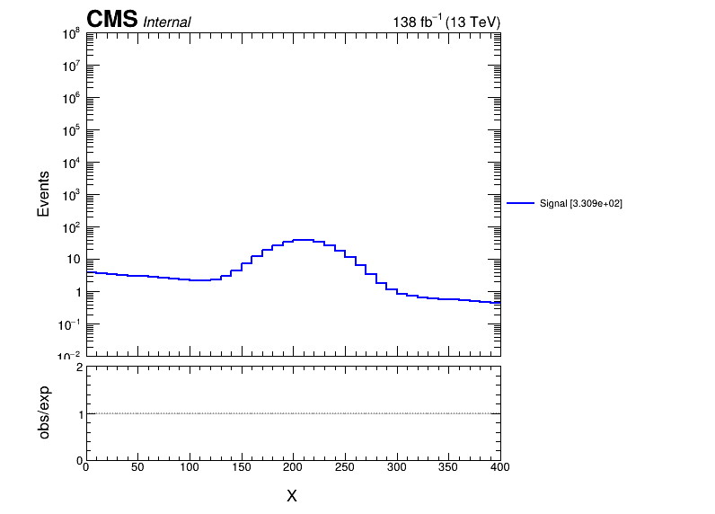
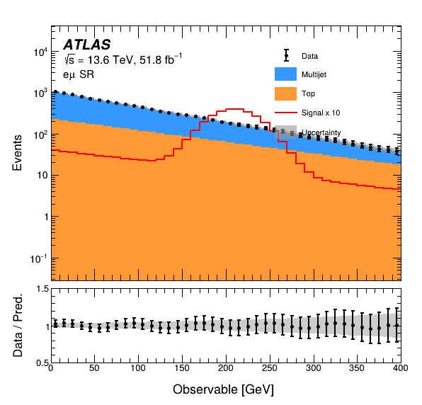

# pyhepplotlib

A small PyROOT histogram plotting library with a minimal `matplotlib`-style interface and the original `Plotter` API underneath.

*External dependency*
- ROOT/pyROOT
- tabulate package for pretty printing


## Quick start

*Minimal histogram plotting*

```python
import pyplotlib.pyplot as plt
plt.style("CMS", lumi=138, year=2018, energy="13 TeV", extraText="Internal")
plt.figure()
plt.hist(h_signal, label="Signal", color=ROOT.kBlue)
plt.draw()
plt.savefig("minimal_histogram_test.png")
```


*For a normal analysis plot, complexity is added only when needed:*

```python
import ROOT
import pyplotlib.pyplot as plt

# Global analysis style: persists across figures.
plt.style("ATLAS", lumi=140, year="Run 3", energy="13 TeV", extraText="Internal", pubStyle=False)

plt.figure()
plt.hist(h_qcd, color=ROOT.kAzure+1, label="Multijet", stack=True, fill=True)
plt.hist(h_top, color=ROOT.kOrange+1, label="Top", stack=True, fill=True)
plt.hist(h_sig, color=ROOT.kRed, label="Signal", scale=10)
plt.hist(h_data, color=ROOT.kBlack, label="Data", isData=True)

plt.xaxis("Jet p_{T} [GeV]", (200, 1500))
plt.yaxis("Events", (0.1, 1e7))
plt.ratio_axis("Data / MC", (0.5, 1.5))
plt.legend(pos=[0.68, 0.45, 0.93, 0.87], fontsize=0.03, col=1)
plt.caption("Example selection")

# These are the original Plotter.Draw options.
plt.draw(logY=True, rebin=2, unc_fstyle=1003, sortLegend=True)
plt.savefig("jet_pt.png")
```
For uncommon advanced settings you can access the current engine:

```python
p = plt.current()
p.debug = True
p.print_info = True
```




Another way of plotting is using the original object-oriented API instead of the matplotlib-style wrapper:

```python
from pyplotlib import Plotter

p = Plotter()
p.setExperiment("ATLAS")
p.figure()
p.hist(h1)
p.Draw()
p.savefig("plot.pdf")
```

*For more test plots checkout the `tests/README.md` gallery*
- plot a single histogram
- overlay of histograms 
- background and signal with stat
- data, background, and signal with stat
- publication style plot

***ToDo***

This is rough to-do list for me in my free time:
- 2D histogram
- TEfficiency plots
- TGraph for limit plots (Yeah, I am sad, I want to make p-value discovery plots. Should I include it first? xD)
- yaml config based plotting wrapper for extensive analysis level collaboration and plotting
- github CI/CD pipeline


## Installation

Open a terminal and go to your work dir. Then follow these steps for a system wide setup:

```bash
git clone https://github.com/alaha999/pyhepplotlib.git
source setup.sh
source run-test.sh
```
If everything went fine, you should see example plots in `tests/outputs/`

Now you can start doing your own plotting by calling (from anywhere in your system),

```bash
import pyplotlib.pyplot as plt
plt.style("CMS", lumi=138, year=2018, energy="13 TeV", extraText="Internal")
plt.figure()
plt.hist(h_signal, label="Signal", color=ROOT.kBlue)  #preparing a histogram h_signal is up to you!
plt.draw()
plt.savefig("minimal_histogram_test.png")
```

## Repo structure

Repo structure for visualisation

```text
.
├── LICENSE
├── pyproject.toml
├── README.md
├── run-test.sh
├── setup.sh
├── src
│   └── pyplotlib
│       ├── __init__.py
│       ├── plotter.py
│       ├── pyplot.py
│       ├── styles.py
│       └── utils.py
└── tests
    ├── dummy_data.py
    ├── gallery.ipynb
    ├── outputs
    │   ├── 01_minimal.png
    │   ├── 02_overlay.png
    │   ├── 03_stack_data_ratio.png
    │   ├── 04_atlas_analysis.png
    │   ├── 05_publication.png
    │   └── 06_rebin_overflow.png
    ├── README.md
    ├── test_core.py
    └── test_gallery.py

```

## Notes

This library is an evolution of a library that I wrote and used in my PhD for plotting purposes. Obviously, the pyplot wrapper was not written at that time. I used to work with Plotter API. Here is the latest github repo of that (with many improvements that my PhD's version xD): `https://github.com/alaha999/plotter`.

Now, I have written the wrapper with the help of AI along with a few optimisations. It feels more like `matplotlib style` now and have an easy `user interface`. Hope it benefits if you are interested.

Feel free to contact me for anything! <br>

*Email:* `arnab.laha@cern.ch`

