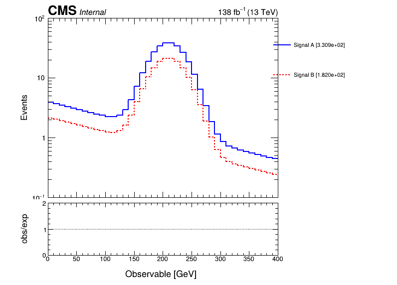
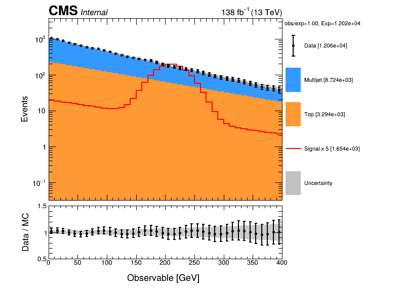
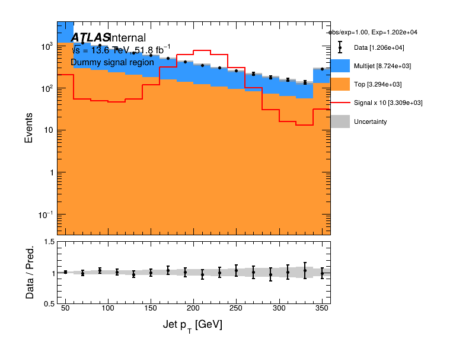
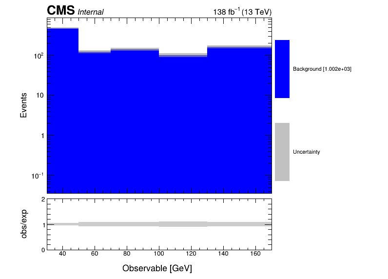

# pyplotlib test

These examples are intentionally progressive: each case adds only the functionality needed for the next level of analysis plotting.

Generate all PNGs from the repository root:

```bash
python tests/test_gallery.py
```

Run regression/safety checks with:

```bash
pytest -q
```

## Test 01 — Minimal ROOT histogram

**Goal:** verify the promised minimal API: `plt.hist(h)`.


## Test 02 — Overlay

**Goal:** multiple non-stacked histograms, line styles, axis range, legend positioning, and log scale.



## Test 03 — Analysis stack + data/MC ratio

**Goal:** stacked backgrounds, scaled signal, observed data, MC uncertainty band, and ratio panel.



## Test 04 — ATLAS analysis style

**Goal:** persistent global ATLAS configuration, caption, custom legend, axis ranges, ratio range, and rebinning.



## Test 05 — Publication style

**Goal:** publication layout with statistical yields removed from the legend.


## Test 06 — X range, overflow folding, truncation, variable rebinning

**Goal:** exercise the histogram transformations most likely to cause accidental state mutation. The source histogram must remain unchanged after drawing.



## Core regression tests

`test_core.py` additionally checks:

- two `Plotter` instances do not share histogram state;
- histograms are cloned/detached before plotting;
- repeated `Draw()` calls do not cumulatively modify source histograms;
- changing rebinning between draws is reversible because drawing starts from clean clones;
- global `plt.style(...)` settings persist across new figures.
- merge overflow-underflow bins test for custom X-range and for truncated case (where we really just want the content of sub X-range)